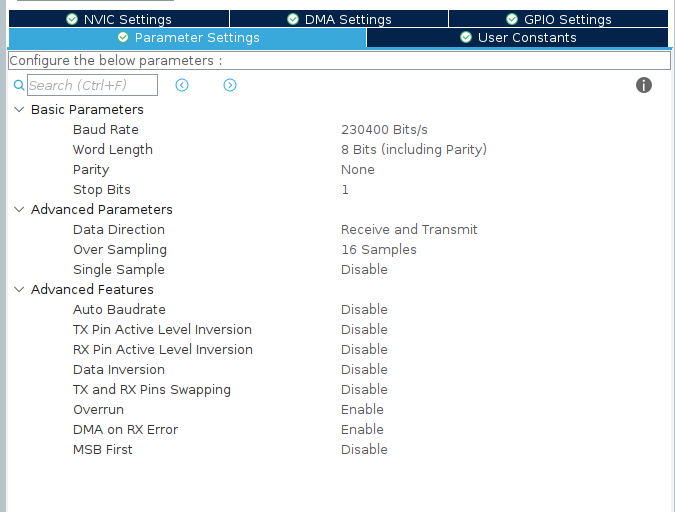
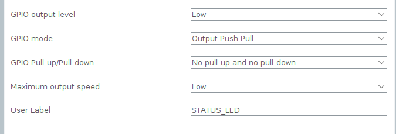

# Inertial Navigation System
This is a project in which an STM32 microcontroller and an MPU6050 IMU were used to
build a so-called **I**nertial **N**avigation **S**ystem (**INS**).

> #### From Wikipedia
> An inertial navigation system [...] is a navigation device that uses motion
> sensors (accelerometers), rotation sensors (gyroscopes), and a computer to
> continuously calculate by dead reckoning the position, orientation, and
> velocity (direction and speed of movement) of a moving object without the
> need for external references.

I mainly focused on achieving good orientation estimation. You still have the
ability to calculate the position and velocity from the accelerometer
measurements. However, doing so without fusing these measurements with other sensors
that supply additional velocity or position references will result in substantial
drifts over time.

## Features
- A complete quaternion-based Kalman filter for orientation estimation.
- Outlier filtering using a median filter.
- 12-parameter in-field calibration of the accelerometer.
- 12-parameter in-field calibration of the gyroscope.
- INS data transmission over the serial port (using the embedded ST-Link).
- An example program for receiving, displaying, and saving transmitted data.

The Kalman filter I used is from my [kfclib](https://github.com/NMIK69/kfclib) repository.
There you will find more information on the design of the filter.

## Project Configuration
> [!NOTE]
> This assumes that you are using the STM32-Cube IDE.

### MPU6050 Communication Configuration
#### I2C
The I2C1 peripheral needs to be used to communicate with the MPU6050.
**I2C1 Configuration:**
- I2C Speed Frequency: 400kHz (fast mode).
- Enable I2C1 event interrupt and set preemption priority to 4.
- Enable I2C1 error interrupt and set preemption priority to 3.
- Create a user label named ``I2C1_SCL`` for the SCL pin.
- Create a user label named ``I2C1_SDA`` for the SDA pin.

#### Interrupt (Data Ready) Pin
Create an EXTI pin with ``external interrupt mode with rising edge trigger`` and without pull-up
or pull-down. Also, create a user label named ``MPU6050_INT_PIN``. Enable the interrupt for it and
give it a preemption priority of 5.

### Timer
Timer 16 is used to provide a nanosecond delay (used for I2C bit banging). This timer
needs to count ``up`` and have a count frequency of 10MHz. The counter period
should be set to the max value. No auto-reload preload.

### UART
To transmit the INS data to a computer, the virtual COM port (aka the embedded ST-Link)
is used. Here is a screenshot of the parameter settings:
Enable the interrupt and set the preemption priority to 6.

### Status LED
A pin (that is connected to the onboard LED) is used to provide status
information. More on that later. You need to have the following
configuration:
Create a user label named ``STATUS_LED``.

### Generating and Importing Files
Before you generate code, go into the code generator settings and enable ``Generate peripheral
initialization as a pair of '.c/.h' file per peripheral``.
Include the source and header files
from the [INS/Core](INS/Core) folder into your project. Include ``ins.h`` inside your main.c 
and call the ``ins_run()`` function before entering the main loop. You can look at the
[INS/Core/main.c](INS/Core/main.c) file for reference.

## Usage Guide
### Initialization
After booting the system, it first performs some initializations and needs to be in a
static state (no translation, no rotation) for the entire duration. During this
timeframe, the status LED will glow. Once the initialization is complete, the LED will
turn off.

### Receiving, Displaying, and Saving Data
I made an example program (terrible code) for receiving, displaying, and saving the transmitted data.
The code only works on Linux. If you want to use it, navigate into the [tui](tui)
folder. From there, execute ``make`` and then run ``./tui -h`` to see how to use it.

### Calibration
Calibration parameters for the gyroscope and accelerometer will certainly differ
from device to device. Thus, you need to change them. Calibration parameters are
stored in the [INS/Core/Src/cal.c](INS/Core/Src/cal.c) file. To calibrate the gyroscope and accelerometer,
I followed the instructions and methods listed in
[this
paper](https://www.researchgate.net/publication/228788329_Methods_for_in-field_user_calibration_of_an_inertial_measurement_unit_without_external_equipment).
The only difference is that I used the normal quaternion rate equation
for integrating the gyroscope measurements. In the future, I will turn this into a separate
repository, where I will provide more information.

#### Calibration Scripts
The authors of the paper said that they solved/optimized the loss function using the
Levenberg-Marquardt algorithm. For the accelerometer loss function, I implemented said algorithm by
hand. Shortly after that, I found out that you can use the ``least_squares`` function from the
``scipy`` Python module to basically do the same thing. For that reason, there are two different
calibration scripts for the accelerometer. For the gyroscope, I only used the ``least_squares``
function. The scripts can be found in the [cal](cal) folder. Each folder also contains the calibration
data that I recorded. Also, consider adepting the initial parameter estimation if you use it on
different data. The variable is named ``z0``.

##### Calibration data format
- **Accelerometer:** Each static measurement is seperated by a new line. Each line has the x, y, and z
axis value seperated by a comma: ``x,y,z``.

- **Gyroscope:** Each calibration data set starts with an accelerometer measurement at the starting
  position. Then follow the gyroscope measurements recorded during the rotation to the end position.
  The last value of the set is an accelerometer measurement at the end position. Each individual
  measurement is sperated by a new line. Each line contains the comma sperated values of the three axis in the
  following order: ``x,y,z``. The end of a set is marked with an ``X`` character on a new line.
